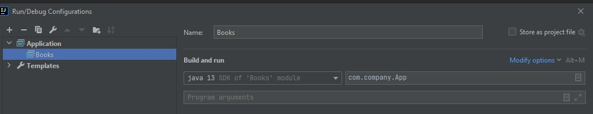
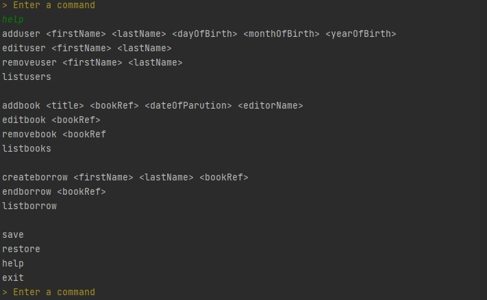
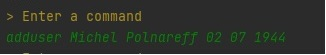
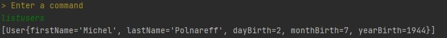
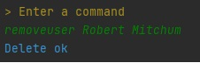
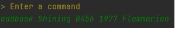
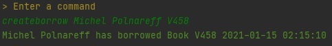
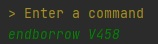
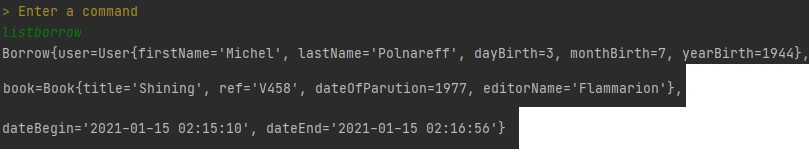

# Books

## Description
Books is Java's projet,
it allows to manage a library with a CLI (Command line interface);

## Configuration

## Commands

Command "help" shows all the commands of the app

You can create Users with firstname("Michel"), lastName("Polnareff") dayOfBirth("03"), month of birth ("07") year of birth("1944"), 

You can also display the user's list

update one user's information

or remove him from the list

You can also create Book with Title(only one word for now, for example "Shining"), reference (for example "B458"), date of parution("1987") and editor("Flammarion").
Actions possible for books are the same as those for users.

Finally we can create a borrow by assiocating an user with a book's reference.

 end it
 

or see the borrow's list

